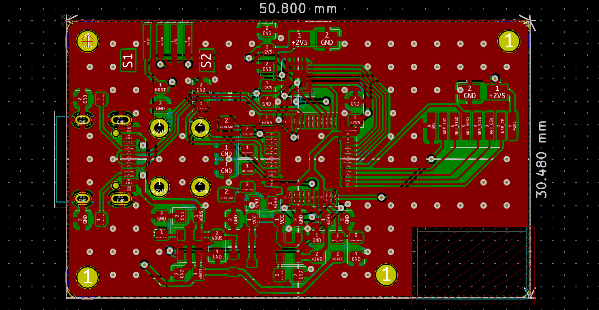
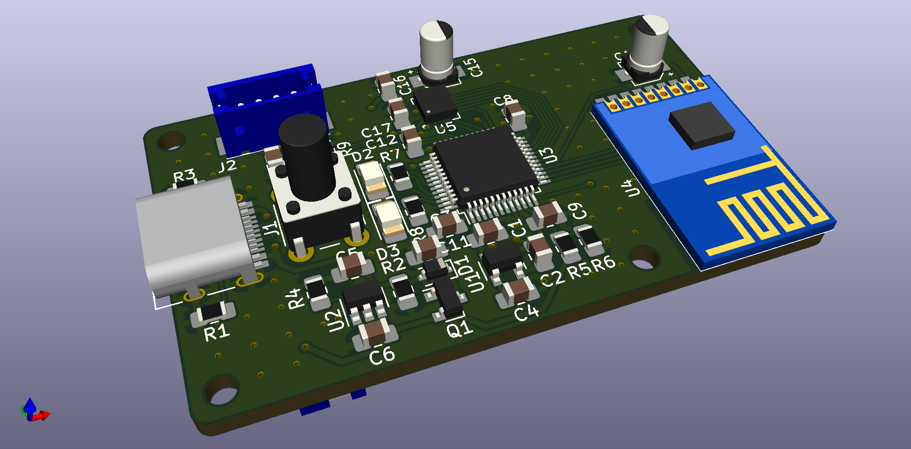

# Bluetrackr

Bluetrackr is a head tracking device. It allows you to track your head orientation & position in realtime. It's mainly used in games such as Elite Dangerous, Star Citizen, Flight simulators, etc to simulate head movement in a cockpit.

## Progress
prototype-v1: There was an unknown problem with the SPI bus. Might be because there are two devices on the same SPI bus?
prototype-v2: Ordered, waiting for parts.

Everything below is for v2.

### Transmitter schematic:

### Transmitter PCB:

### Transmitter PCB 3D view:

## Prototypes

#### Soldered prototype-v1

  
  

#### Board prototype-v2

  
  

